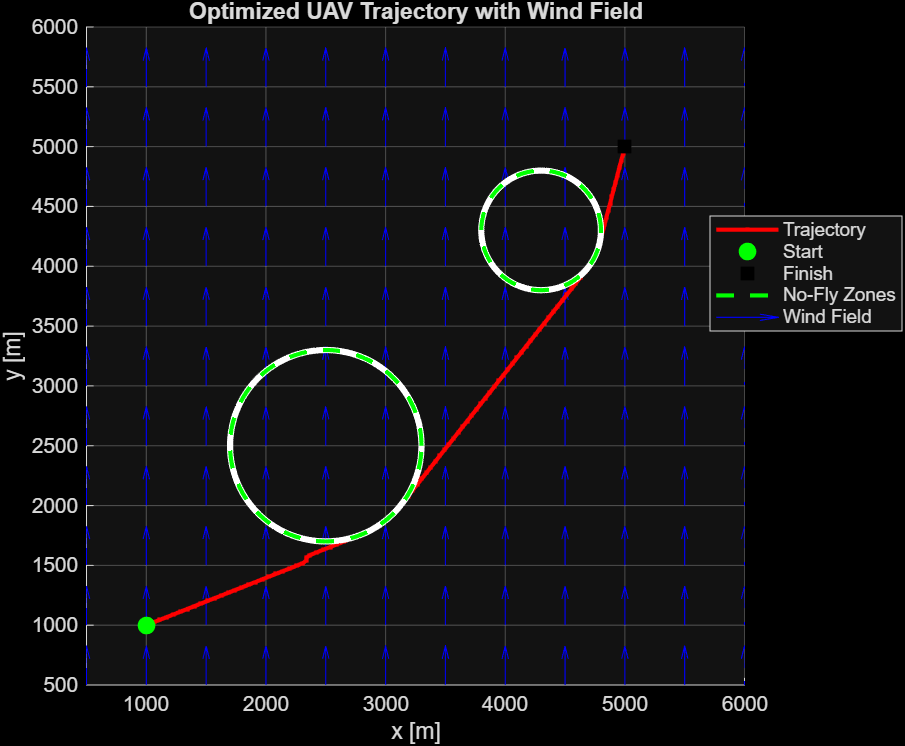

# UAV Trajectory Optimization in Wind Fields

This project implements an optimal control solver for a UAV traveling through a 2D wind field while avoiding no-fly zones.

## Tech stack
- MATLAB
- Trapezoidal collocation
- RRT Path Finder
- Nonlinear optimization (fmincon)

## Features
- Obstacle avoidance with circular no-fly zones
- Smooth heading and speed profiles
- Visualizations of trajectories and control inputs
- Path finding for seed path generation

## Visualizations

### 1. Seed Path (RRT)
The initial path generated using a Rapidly-Exploring Random Tree (RRT) algorithm.

### 2. Optimized Trajectory
Final trajectory after solving the optimal control problem using trapezoidal collocation and `fmincon`.

### 3. State & Control Profiles
Position, velocity, and heading profiles along the optimized path.

## How to run
1. Open `solve_uav_ocp_trapezoidal_complex.m` in MATLAB.
2. Run the script.
3. Plots of the trajectory and control histories will appear automatically.
